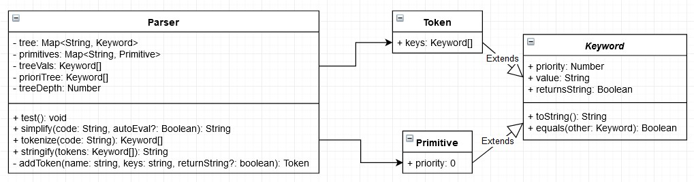
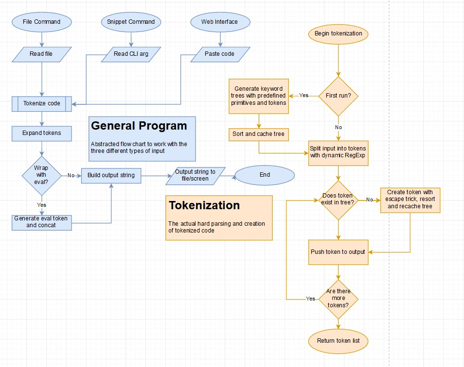

# simple.js

JavaScript has always been a confusing language for a lot of people.

To rectify this, we have created `simple.js`.
It's JavaScript with all the functionality, but none of the complexity.
Like the Simple English Wikipedia, it uses only the most common characters in JavaScript.
With just `+`, `!`, `[` , `]`, `(`, and `)` you can write any JavaScript code.
Who needs variables after all?

> It's so simple, even a monkey with a 6-key keyboard could do it!

## Usage

Unfortunately, `simple.js` is not yet a widely adopted standard.
To simplify vanilla JavaScript, you can use the command line or web interface.

Install all dependencies with `yarn` and build with `yarn run build`.

### CLI

The command-line interface can then be accessed with `yarn start`.
It has two commands, `file` and `snip`.
Pass a file to `file` to simplify it.
Write some code directly into `snip` to get simplified code to stdout.

Run `yarn start --help` for help.

```txt
$ yarn start file test/input.js
Old file size: 70
New file size: 91992

$ yarn start snip 5+5
[!![]+!![]+!![]+!![]+!![]]+(+([+!![]]+(!![]+[])[[!![]+!![]+!![]]]+[[+!![]]]+[[+[]]]+[[+[]]])+[])[[!![]+!![]]]+[!![]+!![]+!![]+!![]+!![]]
```

### Web

To start the web interface, run `yarn start web` and navigate to <http://localhost:8080/front-end>.

## Diagrams

Surprisingly, some of these diagrams are done digitally and not on paper!
We truly live in the digital age.

### UML Diagram



### Flowchart



### Use Case Diagram


